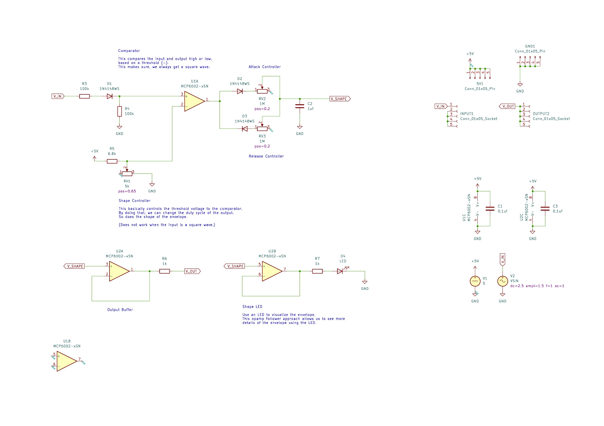
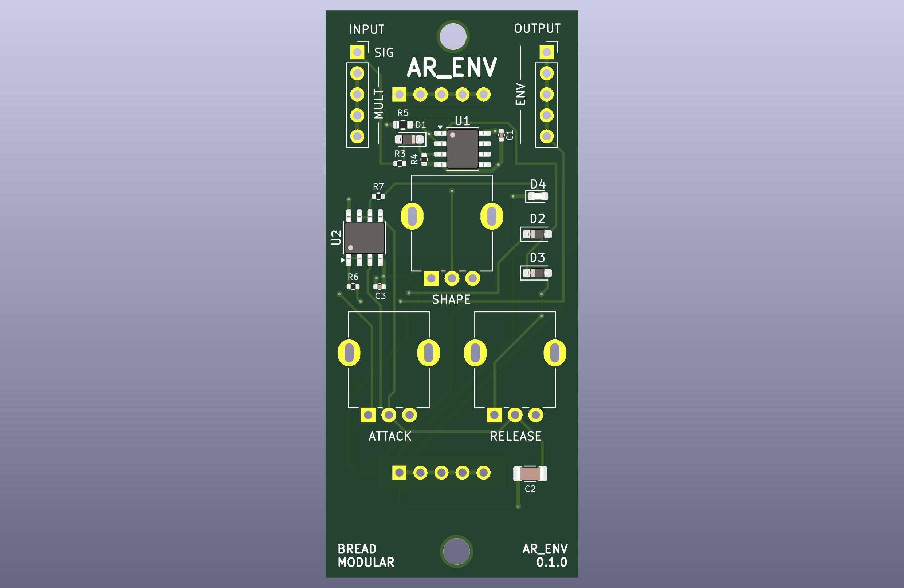

# AR ENV

A Simple Attack/Release Envelope.

This has three controls:

* Attack
* Release
* Shape - Controls the duty cycle. Only works when the "SIG" input is a triangle signal. 

> Make sure to keep the Shape at pos=0.5 when using the square wave inputs.

## Known Errors

* When the Attack & Release is close to zero, this module leaks some pops to the ground.
(So, it will pick up by the line-out)
* When the input is above 5Hz, it's very hard to control Attack & Release. (We need to wiggle between pos=0.0 & pos=0.2)
* Using with JVCA gives more controls, but it will be confusing sometimes. Especially JVCA has a built-in delay effect for changes.
(It could be a feature too)
A simple Vactral based VCA would fix it. (V2CA)