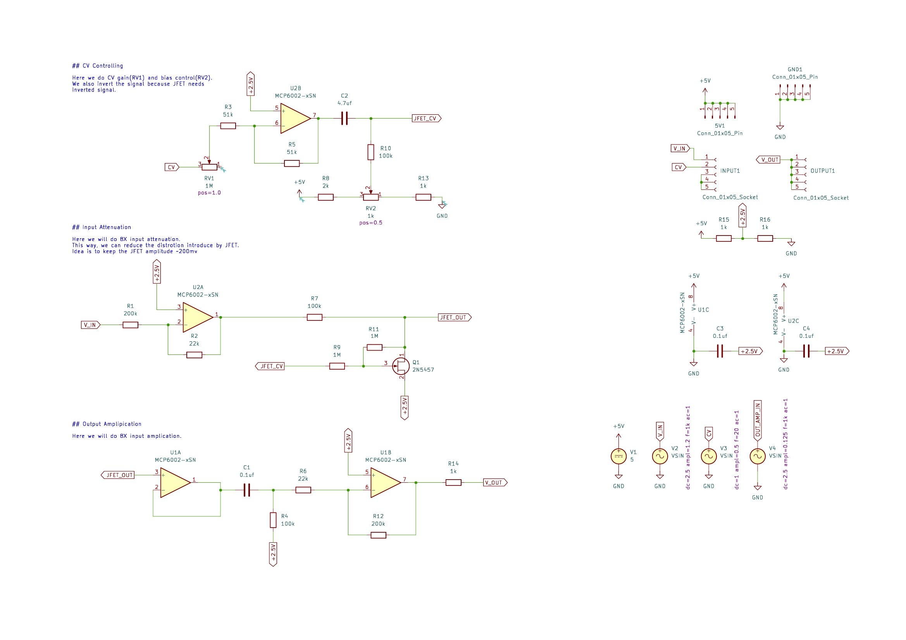
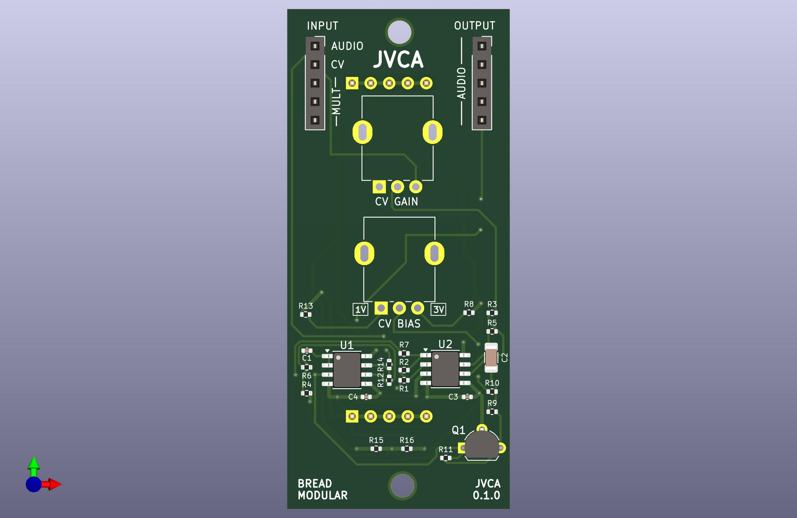

# JVCA

JFET based VCA with bias and gain control.

## Usage

* We can control CV gain with the "CV GAIN" RV and minumum gain is 0.05 and maximum is 1.
* CV bias RV will change the CV bias from 1V to 3V range.
  * If it's 1V, audio is audible even with CV change.
  * If it's 3V, audio is not audible

* If we center the CV around 2V, 500mv amplitude is enough to cut through the audio.
* But we can play with these values to get interesting results

