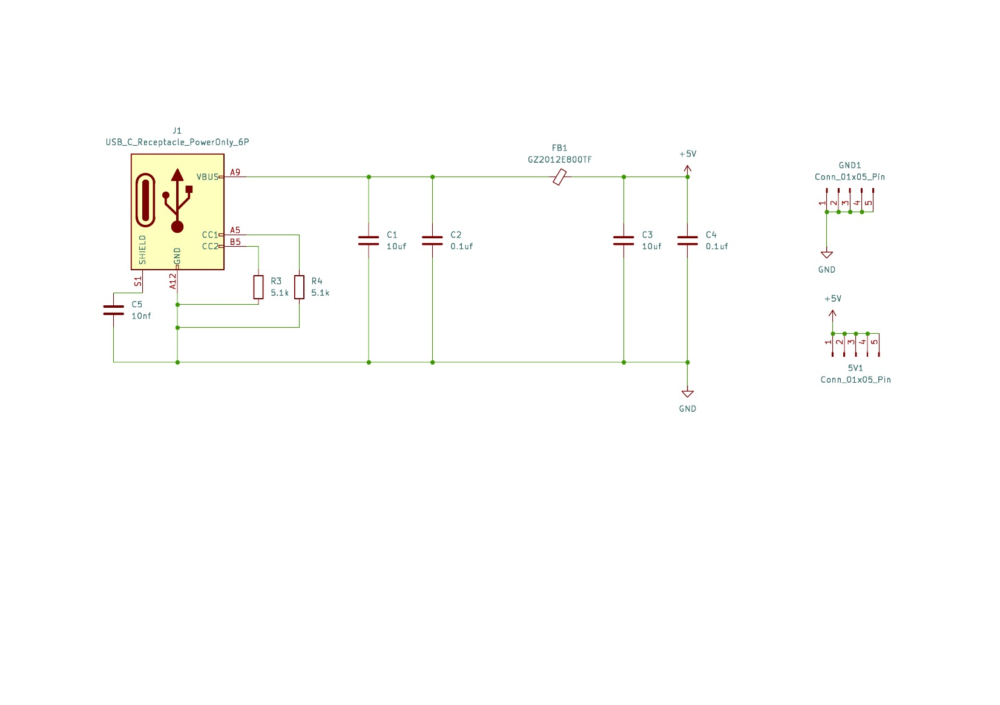
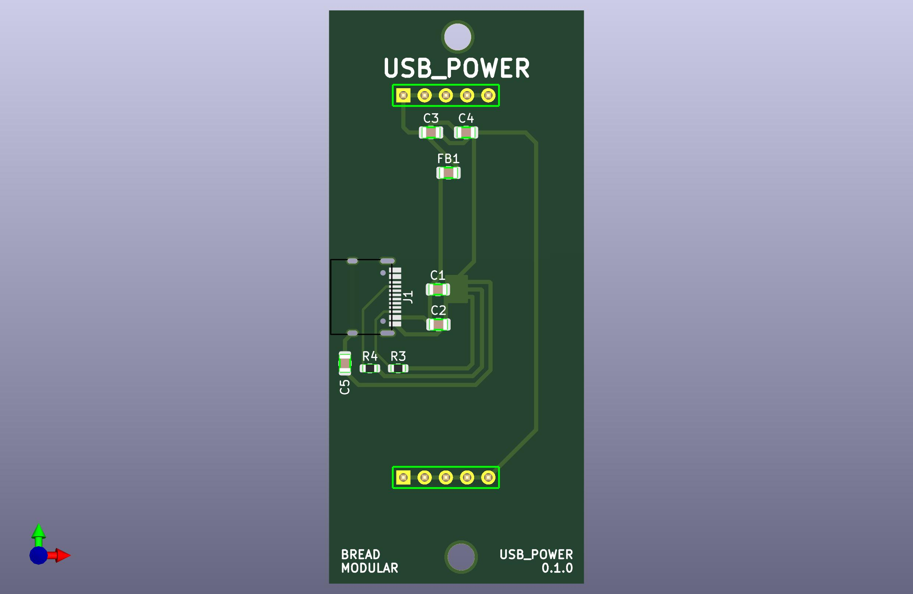

# USB_Power

A simple power source from USB.

## Usage

This plug a USB-C and now we have power to the system. 
This makes is not only to get power from computer, but using bunch of power source including your phone. This will be the only power source we'll ever need.

