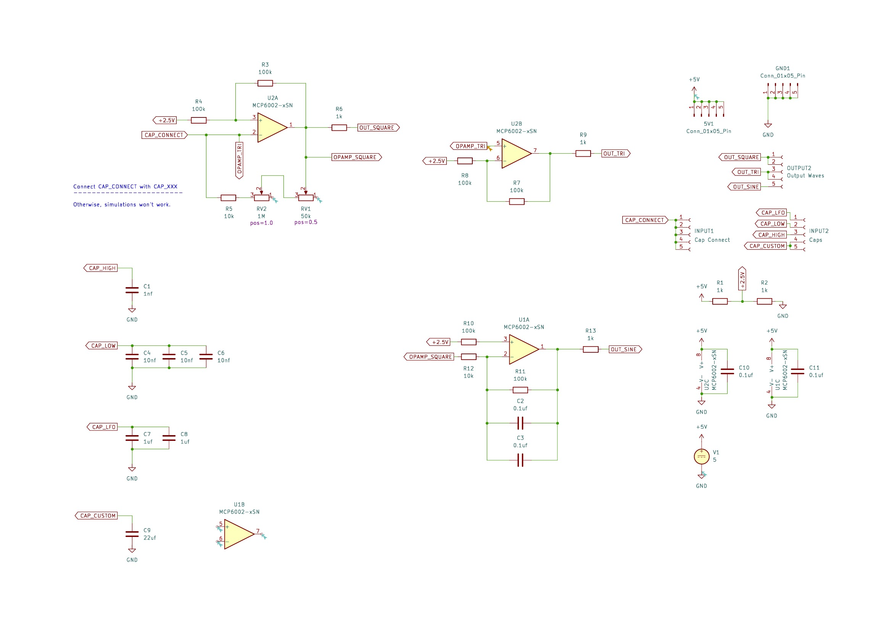

# Wave

A Simple Waveform generator based on opamp relaxation oscillators. It can generate:

* Square
* Triangle 
* Sine (only upword 45Hz)

## Configurations

Before we use this module, we need to configure and select the frequence range via the config jumping panel.

Here are the frequency ranges:

* LFO - 0.22Hz to 22Hz
* LOW - 15Hz to 1.5kHz
* HIGH - 227Hz to 22kHz
* C1 & C2 - Add custom capacitors
  (Resistance => Min: 10k, Max: 1M)

## Usage

You can select the frequency using "FREQ" potentiometer which is 1M ohms. Then you can fine tune it via the 50k ohms "FINE" potentiometer.

(Turning clockwise reduces the resistance)

## Notes

* Does not produce any results, when it's not configured
* Triangle waveform is appoximated & it's not a pure triangle
* Sine wave got distroted when the frequncy is below 45Hz
* Sine wave will be attenuated as the freq increases
* No voltage control input or modulation is supported

